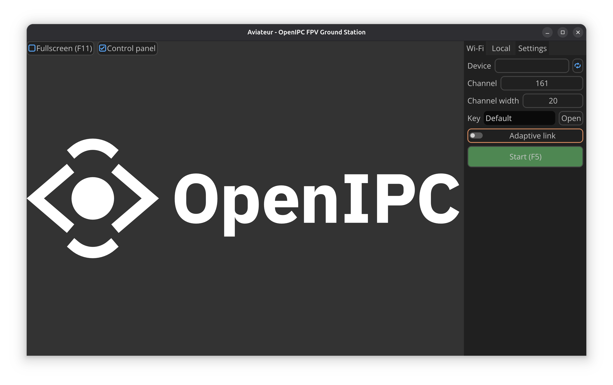
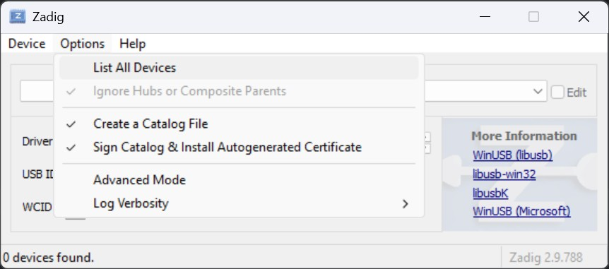
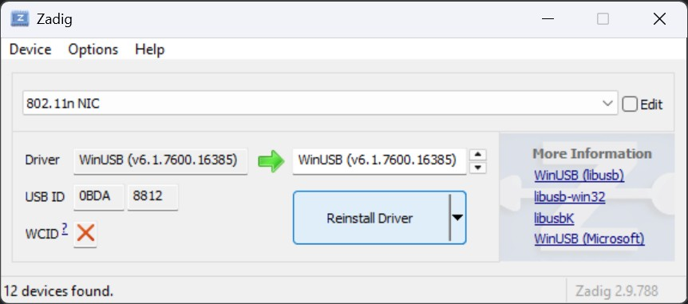
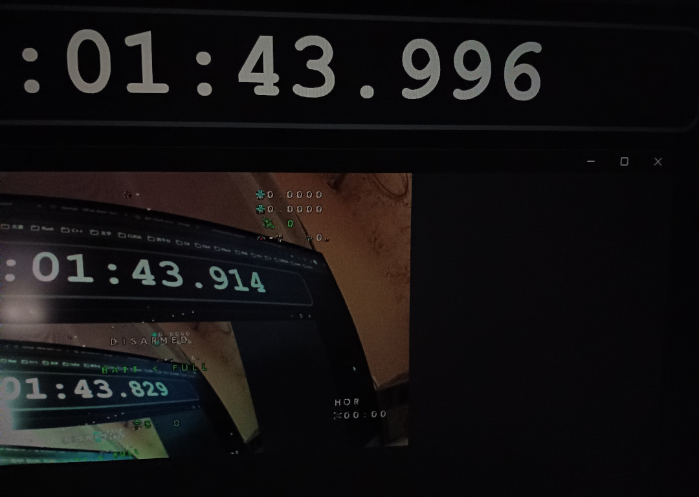
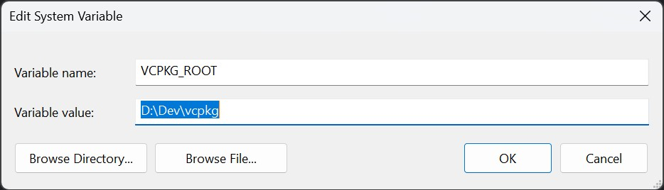

# Aviateur

<p style="text-align: center;">
  <a href="https://github.com/OpenIPC/aviateur">
    
  </a>
</p>

OpenIPC FPV ground station for Linux/Windows/macOS. Forked from [fpv4win](https://github.com/OpenIPC/fpv4win).



> [!NOTE]
> No Adaptive Link support for Windows.

> [!NOTE]
> Only RTL8812AU Wi-Fi adapter is supported.

> [!NOTE]
> No MAVLink support.

### How to run on Windows

1. Download [Zadig](https://zadig.akeo.ie/).
2. Install the libusb driver for your adapter.
   Go *Options* → *List All Devices*
   
   Select your adapter. Install the driver. Remember the USB ID.
   
3. Run Aviateur.

### How to run on Linux

1. (Optional) Go to `/lib/udev/rules.d`, create a new file named `80-my8812au.rules` and add
   `SUBSYSTEM=="usb", ATTRS{idVendor}=="0bda", ATTRS{idProduct}=="8812", MODE="0666"` in it.
   Call `sudo udevadm control --reload-rules`, then reboot (this is definitely required).
2. Run Aviateur (if you skip step 1 & 2, root privileges are needed to access the adapter).

### How to run on macOS

1. Build it from source yourself. Currently, I cannot find a way to distribute it on macOS.
2. **Important**: Run the app from terminal to ensure proper environment variable handling:
   ```bash
   open ./build/bin/aviateur.app
   ```

### Common run issues

* If the application crashes at startup on **Windows**,
  install [Microsoft Visual C++ Redistributable](https://learn.microsoft.com/en-us/cpp/windows/latest-supported-vc-redist?view=msvc-170#latest-microsoft-visual-c-redistributable-version)
  first.

### Latency test



### TODOs

- Ground side OSD

### How to build on Windows

1. Install vcpkg somewhere else.
   ```powershell
   git clone https://github.com/microsoft/vcpkg.git
   cd vcpkg
   .\bootstrap-vcpkg.bat
   ```

2. Install dependencies.
   ```powershell
   .\vcpkg integrate install
   .\vcpkg install libusb ffmpeg libsodium opencv
   ```

3. Add VCPKG_ROOT to environment. (Change the value to your vcpkg path.)
   

4. Clone third-party library sources.
   ```powershell
   git submodule update --init --recursive
   ```

5. Install GStreamer (both the runtime and development installer)
   from [GStreamer](https://gstreamer.freedesktop.org/download/#windows). Add
   `C:\Program Files\gstreamer\1.0\msvc_x86_64\bin` to your PATH environment variable.

6. Build the project.
   ```bash
   mkdir build && cd build
   cmake ../
   make
   ```

### How to build on Linux

1. Clone submodules.
   ```bash
   git submodule update --init --recursive
   ```

2. Install dependencies.

   * GStreamer
   ```bash
   sudo apt install libglib2.0-dev libgstreamer1.0-dev libgstreamer-plugins-base1.0-dev libgstreamer-plugins-bad1.0-dev gstreamer1.0-plugins-base gstreamer1.0-plugins-bad
   ```
   * FFmpeg
   ```bash
   sudo apt install libavformat-dev libavcodec-dev libswresample-dev libswscale-dev libavutil-dev
   ```
   * Vulkan
   ```bash
   sudo apt install libvulkan-dev vulkan-tools vulkan-validationlayers spirv-tools
   ```
   * Other
   ```bash
   sudo apt install libusb-1.0-0-dev libsodium-dev libopencv-dev xorg-dev libpcap-dev
   ```

3. Build the project.

### How to build on macOS

1. Install dependencies:

   Xcode: This assumes you already have Xcode installed and have run `xcode-select --install`

   [Homebrew](https://brew.sh/)

   [Vulkan](https://vulkan.lunarg.com/sdk/home)  - Install Location ~/ (default), no need to pick any extra options in
   installer (default)

   Extra Packages with Homebrew:
   ```bash
   brew install libusb ffmpeg libsodium opencv libpcap cmake
   ```

2. Add the following content to `YOUR_HOME/.zprofile` (change the sdk version and username to your own
   version/username).

   `nano ~/.zprofile`, paste the text in, `ctrl-o` to save, `ctrl-x` to exit.
   ```
   VULKAN_SDK="/Users/zzz/VulkanSDK/1.4.321.0/macOS"
   export VULKAN_SDK
   PATH="$PATH:$VULKAN_SDK/bin"
   export PATH
   DYLD_LIBRARY_PATH="$VULKAN_SDK/lib:${DYLD_LIBRARY_PATH:-}"
   export DYLD_LIBRARY_PATH
   VK_ADD_LAYER_PATH="$VULKAN_SDK/share/vulkan/explicit_layer.d"
   export VK_ADD_LAYER_PATH
   VK_ICD_FILENAMES="$VULKAN_SDK/share/vulkan/icd.d/MoltenVK_icd.json"
   export VK_ICD_FILENAMES
   VK_DRIVER_FILES="$VULKAN_SDK/share/vulkan/icd.d/MoltenVK_icd.json"
   export VK_DRIVER_FILES
   PKG_CONFIG_PATH="$VULKAN_SDK/lib/pkgconfig:$PKG_CONFIG_PATH"
   export PKG_CONFIG_PATH
   ```

3. Log out and in for the above change to take effect.

4. Build the project:
   ```bash
   git clone https://github.com/OpenIPC/aviateur
   cd aviateur
   git submodule update --init --recursive
   mkdir build && cd build
   cmake ../
   make
   ```

5. As noted above, you must run the file through terminal:

   `open ./bin/aviateur.app`

   Or if you want to see the log file while running:
   `./bin/aviateur.app/Contents/MacOS/aviateur`

### Common build issues

On Windows

```
CMake Error at C:/Program Files/Microsoft Visual Studio/2022/Community/Common7/IDE/CommonExtensions/Microsoft/CMake/CMake/share/cmake-3.29/Modules/FindPackageHandleStandardArgs.cmake:230 (message): ...
```

This is because the pre-installed vcpkg from Visual Studio installer overrides the PKG_ROOT environment variable.
To fix this, find `set(CMAKE_TOOLCHAIN_FILE "$ENV{VCPKG_ROOT}/scripts/buildsystems/vcpkg.cmake")` in CMakeLists.txt,
replace `$ENV{VCPKG_ROOT}` with the vcpkg you cloned previously.
