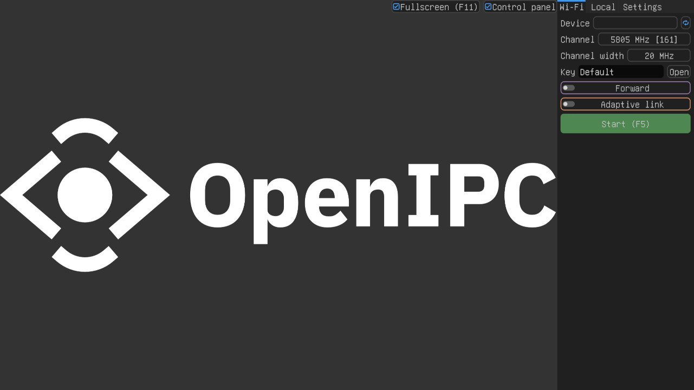

# Aviateur

<p align="center">
  <a href="https://github.com/OpenIPC/aviateur">
    
  </a>
</p>

<p align="center">
  <strong>OpenIPC FPV ground station for Linux, Windows, and macOS.</strong>
</p>

<p align="center">
  
  
  
</p>

---

Aviateur is a high-performance, low-latency FPV ground station specifically designed for
the [OpenIPC](https://openipc.org/) ecosystem. It allows you to receive and display digital video streams from your
drone with minimal lag, supporting modern codecs and hardware acceleration.



## ✨ Features

- **Ultra-Low Latency**: Optimized for real-time FPV flight.
- **Cross-Platform**: Native support for Linux, Windows, and macOS.
- **Flight Recording**: Capture your flights in MP4 or GIF formats.
- **Snapshots**: Save high-quality JPEG screenshots during flight.
- **Hardware Acceleration**: Utilizes GPU for efficient video decoding and rendering (Vulkan/OpenGL).
- **Audio Support**: Real-time audio streaming from the drone.
- **Telemetry & Stats**: Monitor bitrate and link quality in real-time.

## ⚠️ Important Notes

- **Wi-Fi Adapter**: Currently, only **RTL8812AU** Wi-Fi adapters are officially supported for monitor mode.
- **Adaptive Link**: Not currently supported on Windows.
- **MAVLink**: Basic MAVLink telemetry support is on the roadmap but not yet fully implemented.

## 🚀 Quick Start

### Windows

1. Download [Zadig](https://zadig.akeo.ie/).
2. Select your adapter in Zadig (*Options* → *List All Devices*).
3. Install the **libusb** driver.
4. Run `aviateur.exe`.
   > **Note**: If the application fails to start, install
   the [Microsoft Visual C++ Redistributable](https://learn.microsoft.com/en-us/cpp/windows/latest-supported-vc-redist).

### Linux

1. Set up udev rules (required for non-root access):
    - Copy the provided `80-my8812au.rules` to `/lib/udev/rules.d/`.
    - Run `sudo udevadm control --reload-rules`.
    - **Reboot** your system.
2. Launch AppImage.
   > **Note**: If rules are not set, you must run the application with `root` privileges.

### macOS

1. Build from source (see [Build Instructions](#-how-to-build)).
2. Launch executable.

## 🛠 How to Build

### Prerequisites

- CMake 3.18+
- C++20 compatible compiler
- Dependencies: FFmpeg, libusb, libsodium, OpenCV, SDL3

#### Windows (using vcpkg)

1. Install [vcpkg](https://github.com/microsoft/vcpkg).
2. Install dependencies:
   ```powershell
   .\vcpkg install libusb ffmpeg libsodium opencv sdl3
   ```
3. Set `VCPKG_ROOT` environment variable to your vcpkg path.
4. Build:
   ```bash
   git clone --recursive https://github.com/OpenIPC/aviateur
   mkdir build && cd build
   cmake ..
   cmake --build .
   ```

#### Linux (Ubuntu/Debian)

```bash
sudo apt install cmake libavformat-dev libavcodec-dev libswresample-dev \
                 libswscale-dev libavutil-dev libvulkan-dev libusb-1.0-0-dev \
                 libsodium-dev libopencv-dev xorg-dev libpcap-dev
git clone --recursive https://github.com/OpenIPC/aviateur
mkdir build && cd build
cmake ..
make
```

#### macOS (Homebrew)

```bash
brew install pkgconf libusb ffmpeg libsodium opencv libpcap cmake sdl3
git clone --recursive https://github.com/OpenIPC/aviateur
mkdir build && cd build
cmake ..
make
```

## 🔍 Troubleshooting

- **Windows Build**: If CMake fails to find packages despite `VCPKG_ROOT` being set, the pre-installed vcpkg from Visual
  Studio might be overriding it. In `CMakeLists.txt`, you may need to explicitly set `CMAKE_TOOLCHAIN_FILE` to your
  vcpkg path.
- **WSL2**: If you are trying to run Aviateur inside WSL2, you will need to map the USB adapter using `usbipd`.
  See [wsl-map-usb.md](wsl-map-usb.md) for details.
- **Latency**: Ensure you are using a high-quality USB cable and a USB 3.0 port for the RTL8812AU adapter.

## 🚧 Roadmap

- [ ] Zero-Copy YUV renderer.
- [ ] Integrated Ground-side OSD.
- [ ] Full MAVLink telemetry support.
- [ ] Support for additional Wi-Fi chipsets.

## 📄 License

Aviateur is released under the [GPL-3.0 License](LICENSE).

---
<p align="center">Part of the <a href="https://github.com/OpenIPC">OpenIPC Project</a></p>
